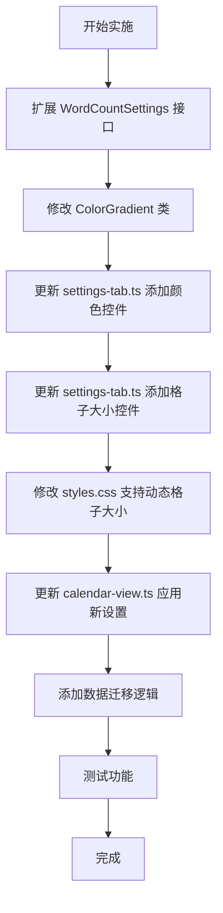

# 字数统计日历插件 - 设置界面增强功能实施计划

## 需求概述

在设置界面增加两个功能：
1. 使用调色器自定义视图格子的颜色，用滑动条表示透明度
2. 支持自定义格子的大小，使用滑动条进行手动调节

## 功能范围

根据用户确认，需要支持：
- **颜色自定义**：无数据格子 + 4个字数等级（Level 1-4），每组包含调色器 + 透明度滑动条
- **格子大小**：使用滑动条手动调节格子尺寸

## 现有代码分析

### 文件结构
- `settings.ts` - 设置接口定义和默认值
- `settings-tab.ts` - 设置界面实现
- `calendar-view.ts` - 日历视图渲染
- `color-gradient.ts` - 颜色渐变逻辑
- `styles.css` - 样式定义

### 现有实现
- `WordCountSettings` 接口包含 `emptyCellColor`（无数据格子颜色）
- `ColorGradient.getColor()` 使用 CSS 变量返回颜色等级
- `.calendar-day` 使用 `aspect-ratio: 1` 保持正方形
- 网格布局使用 `grid-template-columns: repeat(auto-fit, minmax(45px, 1fr))`

## 实施方案

### 步骤 1: 扩展 WordCountSettings 接口

**文件**: `settings.ts`

需要添加以下配置项：

```typescript
export interface ColorWithOpacity {
    color: string;      // HEX 颜色值，如 "#9be9a8"
    opacity: number;    // 透明度，范围 0-100
}

export interface WordCountSettings {
    dailyGoal: number;
    includeFolders: string[];
    excludeFolders: string[];
    dailyNotesFolder: string;
    wordCountCache: WordCountCache;
    dailyNotePaths: { [dateStr]: string };

    // 新增：格子颜色配置
    emptyCellColor: ColorWithOpacity;  // 无数据格子颜色
    level1Color: ColorWithOpacity;     // Level 1: < 40% 目标
    level2Color: ColorWithOpacity;     // Level 2: 40% - 70% 目标
    level3Color: ColorWithOpacity;     // Level 3: 70% - 100% 目标
    level4Color: ColorWithOpacity;     // Level 4: ≥ 100% 目标

    // 新增：格子大小配置
    cellSize: number;  // 格子大小（像素），范围 30-80
}
```

**默认值设置**：

```typescript
export const DEFAULT_SETTINGS: WordCountSettings = {
    dailyGoal: 1000,
    includeFolders: [],
    excludeFolders: [],
    dailyNotesFolder: '',
    wordCountCache: {},
    dailyNotePaths: {},

    // 默认颜色（GitHub 绿色系）
    emptyCellColor: { color: '#ebedf0', opacity: 100 },
    level1Color: { color: '#9be9a8', opacity: 100 },
    level2Color: { color: '#40c463', opacity: 100 },
    level3Color: { color: '#30a14e', opacity: 100 },
    level4Color: { color: '#216e39', opacity: 100 },

    // 默认格子大小
    cellSize: 45
}
```

---

### 步骤 2: 修改 ColorGradient 类

**文件**: `color-gradient.ts`

需要修改 `getColor` 方法，支持自定义颜色和透明度：

```typescript
export class ColorGradient {
    /**
     * 将 HEX 颜色和透明度转换为 RGBA
     */
    private static hexToRgba(hex: string, opacity: number): string {
        // 移除 # 号
        hex = hex.replace('#', '');
        
        // 解析 RGB
        const r = parseInt(hex.substring(0, 2), 16);
        const g = parseInt(hex.substring(2, 4), 16);
        const b = parseInt(hex.substring(4, 6), 16);
        
        // 转换透明度（0-100 -> 0-1）
        const alpha = opacity / 100;
        
        return `rgba(${r}, ${g}, ${b}, ${alpha})`;
    }

    /**
     * 根据字数和目标计算渐变色
     */
    static getColor(
        wordCount: number, 
        goal: number,
        colors: {
            empty: ColorWithOpacity;
            level1: ColorWithOpacity;
            level2: ColorWithOpacity;
            level3: ColorWithOpacity;
            level4: ColorWithOpacity;
        }
    ): string {
        if (wordCount === 0) {
            return this.hexToRgba(colors.empty.color, colors.empty.opacity);
        }

        const ratio = wordCount / goal;

        if (ratio < 0.4) {
            return this.hexToRgba(colors.level1.color, colors.level1.opacity);
        } else if (ratio < 0.7) {
            return this.hexToRgba(colors.level2.color, colors.level2.opacity);
        } else if (ratio < 1.0) {
            return this.hexToRgba(colors.level3.color, colors.level3.opacity);
        } else {
            return this.hexToRgba(colors.level4.color, colors.level4.opacity);
        }
    }
}
```

---

### 步骤 3: 在设置界面添加颜色自定义控件

**文件**: `settings-tab.ts`

需要创建一个辅助方法来生成颜色 + 透明度控件：

```typescript
/**
 * 添加颜色和透明度设置控件
 */
private addColorWithOpacitySetting(
    containerEl: HTMLElement,
    name: string,
    desc: string,
    colorSetting: ColorWithOpacity,
    onChange: (value: ColorWithOpacity) => void
): void {
    const setting = new Setting(containerEl)
        .setName(name)
        .setDesc(desc);

    // 颜色选择器
    setting.addColorPicker(colorPicker => {
        colorPicker.setValue(colorSetting.color);
        colorPicker.onChange(async (value) => {
            colorSetting.color = value;
            await onChange(colorSetting);
        });
    });

    // 透明度滑动条
    setting.addSlider(slider => {
        slider.setLimits(0, 100, 1);
        slider.setValue(colorSetting.opacity);
        slider.setDynamicTooltip();
        slider.onChange(async (value) => {
            colorSetting.opacity = value;
            await onChange(colorSetting);
        });
    });
}
```

然后在 `display()` 方法中添加 5 组颜色设置：

```typescript
// 颜色自定义设置组
containerEl.createEl('h2', { text: '格子颜色设置' });

// 无数据格子颜色
this.addColorWithOpacitySetting(
    containerEl,
    '无数据格子颜色',
    '设置没有数据的日期格子的背景颜色和透明度',
    this.plugin.settings.emptyCellColor,
    async (value) => {
        this.plugin.settings.emptyCellColor = value;
        await this.plugin.saveSettings();
        this.plugin.refreshCalendarView();
    }
);

// Level 1 颜色
this.addColorWithOpacitySetting(
    containerEl,
    'Level 1 颜色',
    '字数 < 40% 目标时的格子颜色和透明度',
    this.plugin.settings.level1Color,
    async (value) => {
        this.plugin.settings.level1Color = value;
        await this.plugin.saveSettings();
        this.plugin.refreshCalendarView();
    }
);

// Level 2 颜色
this.addColorWithOpacitySetting(
    containerEl,
    'Level 2 颜色',
    '字数 40% - 70% 目标时的格子颜色和透明度',
    this.plugin.settings.level2Color,
    async (value) => {
        this.plugin.settings.level2Color = value;
        await this.plugin.saveSettings();
        this.plugin.refreshCalendarView();
    }
);

// Level 3 颜色
this.addColorWithOpacitySetting(
    containerEl,
    'Level 3 颜色',
    '字数 70% - 100% 目标时的格子颜色和透明度',
    this.plugin.settings.level3Color,
    async (value) => {
        this.plugin.settings.level3Color = value;
        await this.plugin.saveSettings();
        this.plugin.refreshCalendarView();
    }
);

// Level 4 颜色
this.addColorWithOpacitySetting(
    containerEl,
    'Level 4 颜色',
    '字数 ≥ 100% 目标时的格子颜色和透明度',
    this.plugin.settings.level4Color,
    async (value) => {
        this.plugin.settings.level4Color = value;
        await this.plugin.saveSettings();
        this.plugin.refreshCalendarView();
    }
);
```

---

### 步骤 4: 在设置界面添加格子大小滑动条

**文件**: `settings-tab.ts`

```typescript
// 格子大小设置
containerEl.createEl('h2', { text: '格子大小设置' });

new Setting(containerEl)
    .setName('格子大小')
    .setDesc('调整日历格子的大小（30px - 80px）')
    .addSlider(slider => {
        slider.setLimits(30, 80, 1);
        slider.setValue(this.plugin.settings.cellSize);
        slider.setDynamicTooltip();
        slider.onChange(async (value) => {
            this.plugin.settings.cellSize = value;
            await this.plugin.saveSettings();
            this.plugin.refreshCalendarView();
        });
    });
```

---

### 步骤 5: 修改 styles.css 支持动态格子大小

**文件**: `styles.css`

需要修改 `.calendar-grid` 的样式，使其能够通过 CSS 变量动态调整：

```css
/* 日历网格 - 自适应布局 */
.calendar-grid {
    display: grid;
    /* 使用 CSS 变量，默认值为 45px */
    grid-template-columns: repeat(auto-fit, minmax(var(--calendar-cell-size, 45px), 1fr));
    gap: 10px;
    margin-bottom: 24px;
    padding: 4px;
}

/* 单个日期格子 */
.calendar-day {
    aspect-ratio: 1;
    /* 其他样式保持不变 */
    ...
}
```

---

### 步骤 6: 更新 calendar-view.ts 应用新的设置

**文件**: `calendar-view.ts`

需要修改以下部分：

1. 在 `renderDays()` 方法中，更新颜色获取逻辑：

```typescript
// 设置背景颜色
const color = ColorGradient.getColor(
    wordCount,
    this.plugin.settings.dailyGoal,
    {
        empty: this.plugin.settings.emptyCellColor,
        level1: this.plugin.settings.level1Color,
        level2: this.plugin.settings.level2Color,
        level3: this.plugin.settings.level3Color,
        level4: this.plugin.settings.level4Color
    }
);
dayEl.style.backgroundColor = color;
```

2. 在 `renderCalendar()` 方法中，应用格子大小设置：

```typescript
async renderCalendar() {
    const container = this.containerEl.children[1];
    container.empty();
    container.addClass('word-count-calendar-container');

    // 设置格子大小 CSS 变量
    container.style.setProperty('--calendar-cell-size', `${this.plugin.settings.cellSize}px`);

    // 其余代码保持不变
    ...
}
```

---

### 步骤 7: 数据迁移

由于设置结构发生了变化，需要考虑旧数据的兼容性。可以在 `main.ts` 的 `loadSettings()` 方法中添加迁移逻辑：

```typescript
async loadSettings() {
    const loadedSettings = await this.loadData();
    
    // 合并设置，确保新字段有默认值
    this.settings = Object.assign({}, DEFAULT_SETTINGS, loadedSettings);
    
    // 兼容旧版本：如果 emptyCellColor 是字符串，转换为 ColorWithOpacity
    if (typeof this.settings.emptyCellColor === 'string') {
        const oldColor = this.settings.emptyCellColor;
        this.settings.emptyCellColor = { color: oldColor, opacity: 100 };
    }
    
    // 确保所有颜色字段都存在
    if (!this.settings.level1Color) {
        this.settings.level1Color = DEFAULT_SETTINGS.level1Color;
    }
    if (!this.settings.level2Color) {
        this.settings.level2Color = DEFAULT_SETTINGS.level2Color;
    }
    if (!this.settings.level3Color) {
        this.settings.level3Color = DEFAULT_SETTINGS.level3Color;
    }
    if (!this.settings.level4Color) {
        this.settings.level4Color = DEFAULT_SETTINGS.level4Color;
    }
    
    // 确保格子大小字段存在
    if (typeof this.settings.cellSize === 'undefined') {
        this.settings.cellSize = DEFAULT_SETTINGS.cellSize;
    }
}
```

---

## 实施流程图



## 文件修改清单

| 文件 | 修改内容 |
|------|---------|
| `settings.ts` | 添加 `ColorWithOpacity` 接口，扩展 `WordCountSettings`，更新 `DEFAULT_SETTINGS` |
| `color-gradient.ts` | 添加 `hexToRgba` 方法，修改 `getColor` 方法签名和实现 |
| `settings-tab.ts` | 添加 `addColorWithOpacitySetting` 辅助方法，在 `display()` 中添加 5 组颜色设置和格子大小设置 |
| `styles.css` | 修改 `.calendar-grid` 使用 CSS 变量 `--calendar-cell-size` |
| `calendar-view.ts` | 更新 `renderDays()` 和 `renderCalendar()` 方法应用新设置 |
| `main.ts` | 添加数据迁移逻辑 |

## 注意事项

1. **向后兼容性**：需要确保旧版本用户的设置能够平滑迁移
2. **性能考虑**：颜色和格子大小的变化会触发日历重新渲染，需要确保性能可接受
3. **UI 布局**：设置界面新增多个控件，需要确保界面布局合理
4. **默认值**：提供合理的默认值，确保新用户开箱即用
5. **边界值**：透明度范围 0-100，格子大小范围 30-80px
